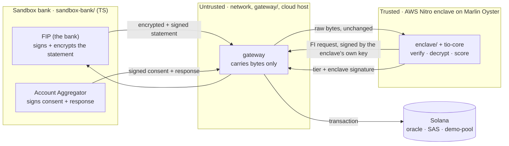
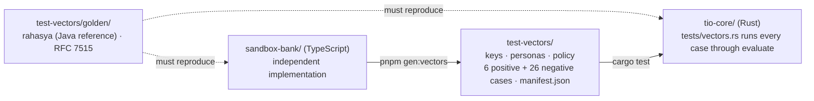

# TEE Income Oracle

A borrower consents through India's Account Aggregator (AA) rail. The signed,
encrypted bank statement is decrypted, verified and scored **inside an AWS
Nitro enclave** (hosted on Marlin Oyster), so no plaintext exists outside it,
not even for the operator. The enclave signs a small risk-tier result with a
key its remote attestation binds to this repo's code. That result is written
to Solana through the Solana Attestation Service (SAS), where any lending
program can read and check it.

The hackathon build uses a **sandbox bank** that speaks the real ReBIT
protocol with test keys: simulated bank, real protocol.

- How it works and why it's secure: [`docs/ARCHITECTURE.md`](docs/ARCHITECTURE.md)
- Every wire and data format: [`docs/FORMATS.md`](docs/FORMATS.md)
- Coding rules: [`docs/CODING-GUIDELINES.md`](docs/CODING-GUIDELINES.md)
- Git workflow and releases: [`CONTRIBUTING.md`](CONTRIBUTING.md)
- For AI agents: [`AGENTS.md`](AGENTS.md)

## How it fits together

Everything between the bank and the enclave is treated as hostile. Data on
that path is either encrypted to a key born inside the enclave or signed with
a key pinned into the enclave image, so the network, the gateway and the
cloud host can delay or drop it, but can't read or change it.



### How the code is tested

`tio-core` is the code the enclave runs. It is checked against two
independent sources: outside reference vectors, and a separate TypeScript
implementation that writes a full set of good and deliberately broken cases.



Positive cases must pass every check. Each negative case breaks exactly one
layer and must fail with exactly its error code (see
[`test-vectors/README.md`](test-vectors/README.md)).

## Layout

```
programs/oracle/     Anchor. Enclave registry, verifies the enclave's secp256k1
                     signature (precompile), writes the SAS attestation.
programs/demo-pool/  Anchor. Reads and checks the SAS attestation, lends testnet tokens.
tio-core/            Rust library, no I/O: crypto, parsing, scoring, payload.
enclave/             Rust HTTP wrapper around tio-core. Runs in the Oyster CVM.
gateway/             Node/TS, untrusted. Orchestrates sessions, relays signed bytes,
                     pays Solana fees.
sandbox-bank/        Node/TS mock FIP + AA speaking ReBIT with test keys. Also the
                     test-vector generator.
verifier/            TS. Checks the Nitro attestation to AWS's root, the image id,
                     and the attester key on chain.
ops/                 TS admin scripts. Creates the SAS credential and schema.
deployments/         Public addresses per cluster, written by ops.
web/                 Next.js. Borrower flow, lender dashboard, verify page.
test-vectors/        Generated fixtures, including golden vectors from Sahamati's
                     reference implementation.
test-fixtures/       Hand-calculated scoring cases; the SAS program binary dumped
                     from devnet for offline tests.
docs/                Architecture, formats, coding guidelines.
```

## Tooling
- Rust **1.89.0** (pinned in `rust-toolchain.toml`, the toolchain Anchor 1.2 supports)
- Anchor 1.2.0 · Solana/Agave CLI 4.3.0
- pnpm 12.6.0 (corepack, `packageManager` in `package.json`) · Node 24 LTS (`.nvmrc`)
- Docker (enclave image) · Python 3 (test-vector tooling)

Two build worlds:
- **Rust/Anchor**: a Cargo workspace (`programs/*`, `tio-core`). See the root `Cargo.toml`.
- **Node/TS**: a pnpm workspace (`gateway/`, `ops/`, `sandbox-bank/`, `verifier/`, `web/`).
  Solana client code uses `@solana/kit` 7 and `sas-lib` 2.0.0-beta.1; local chain tests run
  on embedded [surfpool](https://solana.com/docs/tools/surfpool) (`@solana/surfpool`).

`enclave/` is not in the Cargo workspace. It builds as a Docker image, pinned
by digest and deployed with docker-compose on Marlin Oyster.

## Status
Pre-alpha, under active development. The formats are frozen and the SAS
schema has been verified on devnet. `tio-core` runs the whole evaluate
pipeline: it ties the response and consent to the session, checks the
window, verifies, decrypts, parses and scores the statement, and builds the
attestation payload and the message to sign. It is pinned to reference golden
vectors and cross-checked against the TypeScript test-vector generator in
`sandbox-bank`. `ops` creates and verifies the SAS credential and schema
(tested on surfpool against the deployed SAS binary). Next: the programs,
enclave, gateway and web.

## License
Apache-2.0. See `LICENSE` and `NOTICE`.
