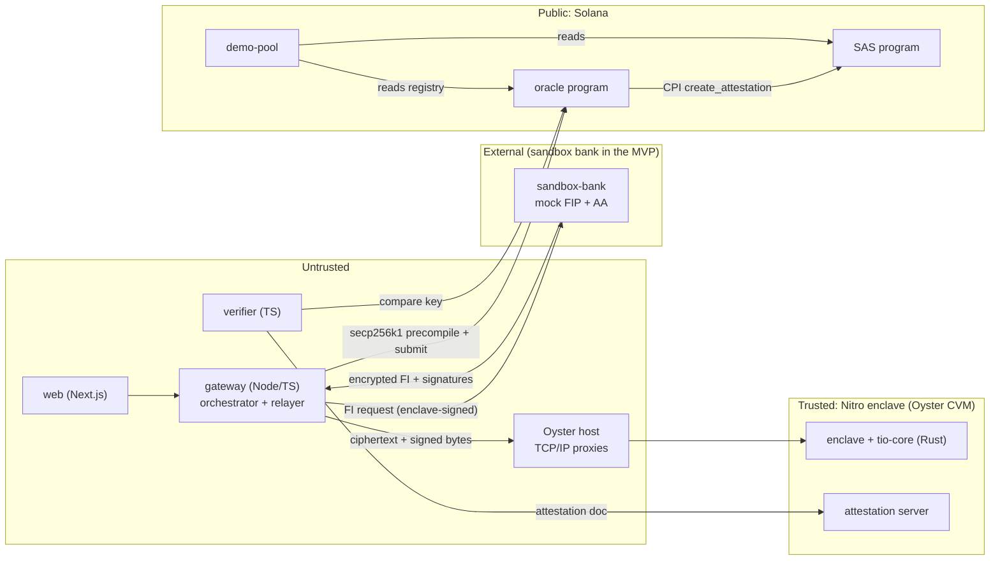
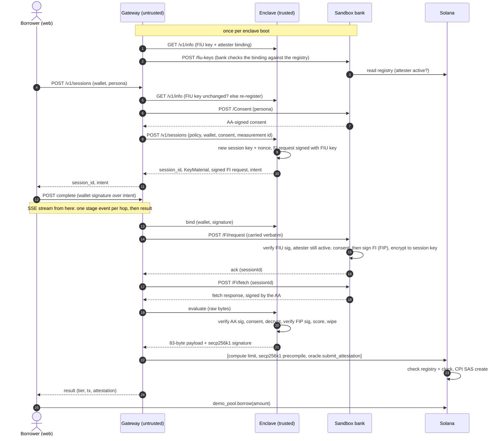

# Architecture

How TEE Income Oracle works and why it is secure end to end. Byte-level
formats live in [`FORMATS.md`](FORMATS.md); this document explains the design
and the security argument.

## 1. Mental model

**A bank statement goes into a sealed box, only a risk tier comes out, and
anyone can check that the box ran the published code.**

| Claim | What makes it true | What it does not cover |
|---|---|---|
| **Provenance**: a licensed AA states the data came from the bank | The AA's signature on the fetch response and on the consent, checked inside the enclave against keys compiled into the image. A FIP signature is checked too where one exists (sandbox only today, see §6) | Accounts the borrower chose not to link. A dishonest AA: it is in the trust base |
| **Blind computation**: nobody, including the operator, saw the data | The decryption key and the FIU request-signing key are both created inside the enclave | AWS hardware and Marlin's base image are trusted |
| **Verifiable output**: the tier came from this code | Nitro remote attestation binds the enclave's signing key to the image id of this repo's build; Solana stores the signed result | MVP: an admin registers the attested key on chain after checking it off-chain |

The security argument is a chain of six links:

| Link | Guarantee | Mechanism |
|---|---|---|
| G1 | Input is genuine | Enclave verifies the AA signature with pinned keys, before parsing. It also verifies a FIP signature where the provider supplies one (sandbox only today, see §6) |
| G2 | Only the enclave can decrypt | Session key and FIU request key are generated inside the enclave |
| G3 | The code is the published code | Image id = measurement of the pinned docker-compose + images; reproducible from the repo |
| G4 | The signing key belongs to that code | The Nitro attestation document carries the enclave's secp256k1 public key |
| G5 | The chain accepts only that key | Oracle registry maps image id → attester. **MVP weak link:** admin-set |
| G6 | Consumers check what they read | Pool checks signer, schema, freshness, approved and still-active enclave, policy hash |

**The one idea to keep:** the machine running the enclave is treated as
hostile, and it is ours. Every design choice answers *how does a host that
carries all the bytes still fail to read or forge them?* The answer is always
one of two things. Either a key is created inside the enclave and never
leaves, or a key is compiled into the measured image so the host can't swap
it.

## 2. Components and trust zones

| Component | Zone | If it turns hostile |
|---|---|---|
| enclave + `tio-core` | trusted | Game over, so it is small, public and attested |
| gateway | untrusted (our server) | Can delay, drop or censor; can't read data or forge a tier |
| Oyster host | untrusted (Marlin operator) | Sees connection metadata only |
| sandbox-bank | external | Can lie about the data; in production the bank is the regulated source |
| oracle / demo-pool | public | Program bugs are public; the admin key is the MVP weak link |
| verifier / web | untrusted | Anyone can run their own verifier; the explorer exposes UI lies |

Oyster forwards raw TCP to the enclave (ports 80, 443, 1024–61439); it
terminates no TLS, so the gateway talks plain HTTP to the enclave's port
8080. That is fine because every byte that matters is signed or encrypted
end to end: the enclave *produces* signed requests and *consumes* signed
responses, and whoever carries them doesn't matter. The port is reachable
from the internet, not only from the gateway, so the enclave caps every
body and every queue itself (FORMATS §10). Oyster can't block outbound
connections either (its own image pull needs them), so "no outbound calls"
is a property of the code: the enclave has no HTTP-client dependency.

## 3. Key inventory

| Key | Type | Born / lives | Used for | If stolen |
|---|---|---|---|---|
| Enclave attester | secp256k1 | Created by Oyster at boot, inside the enclave; new on restart | Signing results; bound by the attestation document | Forge tiers. Mitigation: never leaves; revoke the registry entry |
| Session DH | Curve25519 + 32-byte nonce | Inside the enclave, per session; wiped after | ECDH with the FIP's one-time key | One session's data (forward secrecy) |
| FIU request key | RSA-2048 | Inside the enclave, new on every boot; its public half is signed by the attester key at boot (FORMATS §8.1) | Signing `FI/request`, which carries the session key material | Swap in its own DH key and read statements. **This is why it lives inside the enclave**, and why the bank checks the attester's binding signature before trusting it |
| FIP / AA signing keys | RSA-2048 | Bank / AA (sandbox: demo keys, never committed) | Signing FI data, fetch responses, consent | Forge bank data. Public halves pinned in the image |
| Oracle SAS signer | PDA `["sas_signer"]` | Derived; no private key | Only authorized signer on the SAS credential | Can't be stolen; only program logic uses it |
| Admin | wallet for the demo; a multisig (e.g. Squads) beyond it. Replaceable by `propose_admin` + `accept_admin` | Operator | Register/revoke enclave builds | Register a fake enclave (G5). If lost: no revokes until a program upgrade |
| Program upgrade authority | wallet for the demo (the same wallet as the admin, the SAS credential authority and the pool admin, `ops/README.md`); a multisig with a timelock beyond it | Operator | Deploying program upgrades; `initialize` | Everything on chain: an upgrade can replace the oracle's checks and write any attestation as the `sas_signer` PDA. No timelock in the MVP |
| Relayer | wallet | gateway | Paying fees | Spend its SOL; can't forge |
| AWS Nitro root | ECDSA P-384 cert | AWS; pinned in the verifier | Root of the attestation chain | Everything: "trust AWS and the code" |

Test-vector keys are committed on purpose and **nothing deployed trusts
them**. The enclave refuses to start if a pinned key is a test key
(FORMATS §2).

## 4. End-to-end flow

What a hostile gateway or host can do at each hop:

| Hop | It sees | It can | It cannot |
|---|---|---|---|
| Session create | public key material, signed FI request | read public keys | change the key (the FIU signature covers it), or swap the FIU key itself (the bank checks the attester's binding, FORMATS §8.1) |
| Bind | intent, wallet signature | drop it | bind a wallet it doesn't control |
| Fetch | AES-GCM ciphertext, signed envelopes | store it | decrypt it, or alter it (GCM tag + signatures) |
| Evaluate | raw bytes in, signed payload out | replay old bytes | get them accepted (one-time session nonce) |
| Submit | Solana transaction | censor it | change the tier (signature breaks) |
| Borrow | — | — | use another wallet's attestation (the pool derives the address from the signing borrower), one the oracle's signer didn't write, an expired or stale one, or one from an enclave build the pool hasn't approved or the registry revoked (FORMATS §14) |

## 5. Threat model

| Adversary | Defence | Residual |
|---|---|---|
| Hostile gateway/host reading data | keys born inside (G2); ciphertext only | metadata: timing, sizes, and which wallet ran which session |
| Hostile gateway/host forging data or tiers | pinned keys, verify before parse (G1); session binding: response `txnid` and consent `consentId` must be the enclave's own (FORMATS §10.1); attested signer (G4/G5) | censorship, delay |
| Host lying about "today" | window = the statement's own dates, inside the enclave's requested range, inside the signed consent; refused if too short or stale (request and statement) or the request ends after `now`; `issued_at` checked against the Solana clock (≤ 300 s ahead), and the signature usable for at most 600 s after it (FORMATS §8) | ± 5 min skew window (`MAX_SKEW_SECS`) |
| Borrower reusing another wallet's tier | SAS nonce = wallet; the pool derives the attestation address from the signing borrower | collusion (same as sybil) |
| Attestation not written by the oracle (a foreign credential, or a signer added to ours) | pool pins credential + schema through the address and requires the stored SAS signer to be the oracle's PDA | — |
| Borrower reusing an old result | SAS expiry (30 days) and the pool's own limits on attestation age, statement age and statement length | anything inside those limits |
| Borrower using a fresh wallet | none in the MVP | **sybil gap**: documented, never claimed solved |
| Lender changing rules silently | `policy_hash` in the payload; pool pins it | — |
| Replay of an enclave signature elsewhere | domain tag + program + credential + schema + wallet + expiry all signed | — |
| Replaying a signature, or an older one replacing a newer tier | per wallet, a refresh needs a strictly newer `issued_at` (FORMATS §13) | — |
| Tricking the precompile check | instruction-index fields must point at the precompile itself | a classic Solana bug class; tested explicitly |
| Bug in enclave code | small code, public source, zeroize, single-use sessions that share no state | attestation proves *which* code ran, not that it's correct |
| Admin reusing a revoked registry id | ids are append-only | the id space is 255 for the life of a deployment (FORMATS §13 "Id budget") |
| Admin key | public registry events; anyone can re-run the verifier; a compromised key is replaceable (`propose_admin` + `accept_admin`) | the MVP weak link (G5); a multisig beyond the demo, then ZK-verified attestation |
| Program upgrade authority | the programs stay upgradeable so a lost admin can be recovered (`programs/oracle/README.md`); upgrades are public on chain | can replace any check, bypassing the registry. In the demo one wallet holds it plus every admin role; beyond the demo: separate keys, a multisig and a timelock, then an immutable program |
| AWS | none | accepted: "trust AWS and the code" |
| Anyone on the internet exhausting the enclave (its port is public) | caps on open sessions (256), create/bind requests in flight (32), evaluate requests in flight (4), evaluations running (2), body size and read time, and base58 length before decoding; slots taken before a body is read and held until the work ends (FORMATS §10) | accepted liveness risk: a caller who can get consents can keep the session cap full and lock others out. The sandbox bank issues consents to anyone who reaches it, but only the gateway can (internal ingress, FORMATS §15), and the gateway rate-limits session creation per client IP and globally (FORMATS §16); a consent flood at the bank itself can at worst evict unused consents. The host and gateway can already deny service, so availability is never guaranteed |

## 6. Guarantees and limitations

**Guaranteed** (given that AWS Nitro and the published enclave code are trusted):
- The operator, the gateway and the enclave host cannot read a borrower's
  statement. The decryption key is created inside the enclave and never
  leaves it.
- Anyone can check that a tier came from a specific build of this repo. The
  verifier ties the attested key to the image id recomputed from source.
- A tier can't be altered, moved to another wallet, or replayed in another
  context. The signed message covers the domain tag, program, credential,
  schema, wallet, payload and expiry.
- A lending pool can require a specific scoring policy, since `policy_hash`
  is part of the signed payload.
- Nothing personal is written on chain: only a tier, ids, hashes and
  timestamps.

**Not provided:**
- **Trustlessness.** The trust root is AWS Nitro plus the enclave code, and
  Marlin's base image in this deployment.
- **On-chain verification of the enclave.** In the MVP an admin registers
  the attested key after checking it off-chain (link G5).
- **Encryption the AA rail doesn't already give.** AA already encrypts in
  transit; what this adds is *blind computation* and a *verifiable result*.
- **A bank's signature on the data.** The sandbox bank signs FI data; that
  is an extension of this repo. The ReBIT spec does not give the FIU one:
  each hop signs its own HTTP body, the AA's `FIFetchResponse` carries only
  `fipID`, `encryptedFI` and `KeyMaterial`, and the DEPOSIT schema has no
  signature element (checked 2026-10-05 against AA 2.1.0, FIP 2.2.0 and
  `deposit_v2.0.0.xsd`). Decryption proves nothing to a third party either,
  because ECDH with AES-GCM is symmetric. So for real data the provenance
  claim is "a licensed AA states that this FIP returned this statement", and
  the AA joins the trust base. Whether a given AA forwards a FIP signature
  outside the spec is unconfirmed.
- **Sybil resistance.** One person with several wallets can get several
  tiers.
- **High availability.** One enclave instance processes sessions one at a
  time. Its attester key changes on restart, so a restart needs
  re-registration. Several replicas of one build aren't supported by the
  one-attester-per-entry registry. `enclave:rotate` also revokes the old
  entry, so after a restart every outstanding tier stops working for new
  borrows and each borrower attests again (open loans are unaffected).
- **A live AA connection as-is.** The FIU request key is new on every boot.
  The sandbox bank trusts it through the on-chain registry, but a real AA
  onboards an FIU's public key out of band. Going live needs a stable FIU
  key (e.g. sealed by a KMS to the enclave's measurement) or a re-onboarding
  flow with the AA, plus a regulated FIU of record.
- **Whole-household or whole-borrower income.** One session scores one
  account (FORMATS §5.2), chosen by the borrower, so obligations paid from
  another account are not seen. Every non-bounce credit counts as income,
  including self-transfers and loan proceeds (FORMATS §6.1). Obligations are
  found from narration tokens and recurrence, so EMIs paid without those
  tokens are missed. The thresholds are policy, pinned by `policy_hash`; the
  classification rules are code, pinned by the image id. Thresholds are not
  calibrated on repayment data.
- **Rent reclaim for expired attestations.** No instruction closes an
  expired SAS attestation; its rent (≈ 0.00195 SOL) stays locked until the
  same wallet refreshes (FORMATS §7).
- **A replacement for underwriting.** The tier covers ability to pay, from
  bank cash flow. It does not cover intent to pay or identity.

## 7. Swapping the TEE platform

The MVP runs on Marlin Oyster. Self-hosted AWS Nitro is the likely production
path (a longer-lived enclave, and an attester key released by AWS KMS only to
a matching PCR0, with no extra trust party). The design keeps that swap at
the edges:

| Stays the same | Changes |
|---|---|
| `tio-core`, the enclave's `/v1` API, gateway, sandbox-bank, web | packaging: docker-compose → `nitro-cli` `.eif` |
| on-chain programs, SAS schema, 83-byte payload, signed message | networking: TCP/IP → vsock bridge on the parent |
| secp256k1 attester, so the on-chain check never changes | key source: Oyster-provided → generated in enclave or released by KMS |
| registry format (platform-neutral `measurement` + `measurement_kind`) | measurement: image id → PCRs; verifier checks change |

A swap is a new registry entry (new `measurement_id`, `proof_type` 2). Both
run side by side, pools approve the new entry, and the old one is revoked.
Nothing already on chain is rewritten. Platform-specific enclave code stays
in one small module.

## 8. Where the details live

| Topic | File |
|---|---|
| Key exchange, encryption, JWS, ReBIT messages, payload, signed message, enclave API, test-vector layout, version identifiers | [`FORMATS.md`](FORMATS.md) |
| Security rules and language conventions | [`CODING-GUIDELINES.md`](CODING-GUIDELINES.md) |
| Invariants AI agents must not break | [`../AGENTS.md`](../AGENTS.md) |
| Reference vectors from Sahamati's implementation | [`../test-vectors/golden/rahasya/`](../test-vectors/golden/rahasya/) |
