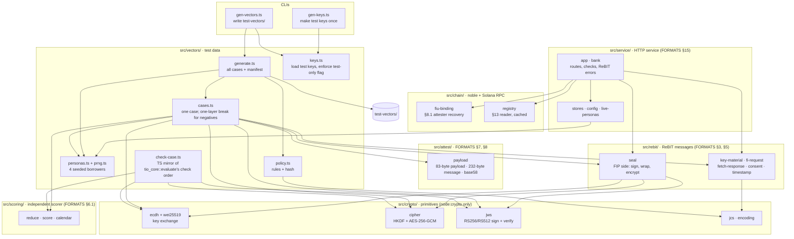

# sandbox-bank

Node/TS mock **FIP + AA** that speaks the real ReBIT protocol with test data:
"simulated bank, real protocol". When a real AA replaces it, the enclave's
protocol code doesn't change, but the pinned keys and the base URL do, and
so does FIU key onboarding. This bank accepts a new FIU key on every enclave
boot because the on-chain registry vouches for it (`POST /fiu-keys` below).
A real AA onboards an FIU's public key out of band, so a key that changes per
boot needs either a stable key (e.g. sealed by a KMS to the enclave's
measurement) or a re-onboarding flow with that AA (`docs/ARCHITECTURE.md` §6).

- Serves four borrower personas (DEPOSIT schema, 6–12 months): salaried/steady,
  lumpy trader, declining, stressed. The live service rebuilds each statement
  so it ends on the day the enclave asks for.
- HTTP API (`docs/FORMATS.md` §15):
  - `POST /fiu-keys`: registers an enclave's FIU key. The attester address
    recovered from its binding signature (§8.1) must be an active entry in the
    on-chain oracle registry (§13).
  - `POST /Consent`: issues an AA-signed consent for a persona.
  - `POST /FI/request`: verifies the enclave's FIU signature and that its
    attester is still active, applies the consent rules (one request per
    consent), signs the FI JSON with the FIP key and encrypts it to the
    enclave's session key (Curve25519 `wei25519`/X25519 → HKDF → AES-256-GCM).
    Replies with a session id.
  - `POST /FI/fetch`: the AA-signed fetch response, once per session.
- **Gateway only:** the bank must be reachable only from the gateway, which
  rate-limits (FORMATS §15): over a private network, or with `BANK_TOKEN`
  set on both (every route but `/health` then needs `authorization: Bearer
  <token>`, checked before the body is read). The devnet deployment uses the
  token, because its Azure environment has no private networking
  (`docs/DEPLOY.md` §4). `/fiu-keys` and `/Consent` need no other
  authentication.
- **Keys:** the running service uses **demo keys that are never committed**.
  `pnpm --filter @tio/sandbox-bank gen:demo-keys` makes them once (it refuses
  to overwrite): private JWKs in `sandbox-bank/.secrets/` (gitignored; back
  them up outside the repo), public halves in `enclave/pinned/`, compiled into
  the enclave image. New demo keys mean a new image id.
- The same crypto module is the **test-vector generator**. It writes
  `test-vectors/` with fixed test keys, including the negative cases (one
  broken layer each; see `docs/FORMATS.md` §11).

**Status:** the HTTP service, the test-vector generator and the demo-key
generator work. The service runs locally and in Docker; it isn't deployed yet.

It writes the cases that `tio-core` must accept or reject: see
[how the code is tested](../README.md#how-the-code-is-tested) and the
[check order](../test-vectors/README.md#check-order-and-error-codes).

## Modules

Dependencies point down only: `crypto/` is pure primitives (`node:crypto`,
no runtime dependencies), `rebit/` builds the ReBIT messages on top of it, and
`vectors/` is the test-data logic. `chain/` holds what needs noble (secp256k1
recovery, keccak) or Solana RPC: the §8.1 binding and the registry reader.
`service/` is the HTTP server (Hono). It reuses `crypto/`, `rebit/` and the
persona builder from `vectors/`. `testing/` holds test-only helpers.



## Commands

```bash
pnpm --filter @tio/sandbox-bank test          # vitest
pnpm --filter @tio/sandbox-bank typecheck     # tsc
pnpm --filter @tio/sandbox-bank lint          # oxlint --type-aware
pnpm --filter @tio/sandbox-bank format:check  # oxfmt
pnpm gen:vectors                              # rewrite test-vectors/ (deterministic)
pnpm --filter @tio/sandbox-bank start:local   # run the service; demo keys from .secrets/
```

`start:local` reads the demo keys from `.secrets/` (run `gen:demo-keys` once
first) and defaults `SOLANA_RPC_URL` to a local validator. `start` (and the
image) read everything from the environment: `SANDBOX_AA_PRIVATE_JWK`,
`SANDBOX_FIP_PRIVATE_JWK` (JSON text), `SOLANA_RPC_URL`, optional
`ORACLE_PROGRAM_ID`, `PORT` (8081) and `PINNED_DIR`. The service refuses to
start with a test key or with a key that differs from `enclave/pinned/`.

Docker image (build context: the repo root; `sandbox-bank/Dockerfile.dockerignore`
keeps `.secrets/` and tests out):

```bash
docker build -f sandbox-bank/Dockerfile -t tio-sandbox-bank:dev .
docker run --rm -p 8081:8081 -e SANDBOX_AA_PRIVATE_JWK="$(cat sandbox-bank/.secrets/aa.demo-private.jwk.json)" \
  -e SANDBOX_FIP_PRIVATE_JWK="$(cat sandbox-bank/.secrets/fip.demo-private.jwk.json)" \
  -e SOLANA_RPC_URL=https://api.devnet.solana.com tio-sandbox-bank:dev
```

Runs on Node 24 with native TypeScript type stripping (no build step), so
only erasable TypeScript works: no parameter properties, `enum` or
`namespace` (vitest accepts them; `node` does not).
