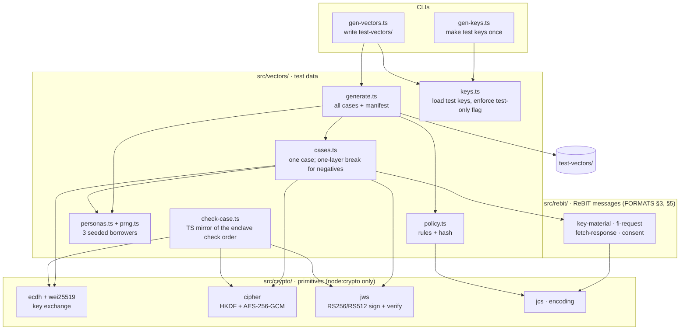

# sandbox-bank

Node/TS mock **FIP + AA** that speaks the real ReBIT protocol with test data:
"simulated bank, real protocol". When a real AA replaces it, the enclave code
doesn't change; only the pinned keys and the base URL do.

- Serves three borrower personas (DEPOSIT schema, 6–12 months): salaried/steady,
  lumpy trader, stressed.
- On `POST /FI/request`: verifies the enclave's FIU signature, signs the FI
  JSON with the FIP key, encrypts it to the enclave's session key (Curve25519
  `wei25519` → HKDF → AES-256-GCM), and signs the fetch response with the AA
  key. Also issues the consent artefact.
- **Keys:** the running service uses **demo keys that are never committed**
  (`.env` / secret store). Only their public halves are pinned in the enclave.
- The same crypto module is the **test-vector generator**. It writes
  `test-vectors/` with fixed test keys, including the negative cases (one
  broken layer each; see `docs/FORMATS.md` §11).

**Status:** the generator works (build step 1c); the HTTP service is build
step 4.

It writes the cases that `tio-core` must accept or reject: see
[how the code is tested](../README.md#how-the-code-is-tested) and the
[check order](../test-vectors/README.md#check-order-and-error-codes).

## Modules

Dependencies point down only: `crypto/` is pure primitives (`node:crypto`,
no runtime dependencies), `rebit/` builds the ReBIT messages on top of it, and
`vectors/` is the test-data logic. The live service (step 4) will reuse
`crypto/` and `rebit/` unchanged; only `vectors/` is test-only.



## Commands

```bash
pnpm --filter @tio/sandbox-bank test          # vitest
pnpm --filter @tio/sandbox-bank typecheck     # tsc
pnpm --filter @tio/sandbox-bank lint          # oxlint --type-aware
pnpm --filter @tio/sandbox-bank format:check  # oxfmt
pnpm gen:vectors                              # rewrite test-vectors/ (deterministic)
```

Runs on Node 24 with native TypeScript type stripping (no build step).
