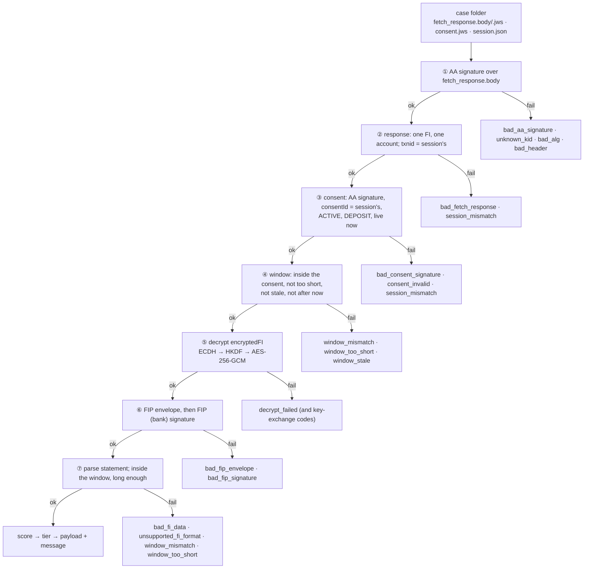

# test-vectors

## What this is

An answer key for the project's cryptography and scoring. Each vector is a
fixed input plus the exact output it must produce. Examples: a bank statement
encrypted to a known key, its signatures, and the tier it should score to.

It is used for three things:

- **Proving the code is correct.** `tio-core` (Rust) and the TypeScript
  generator / sandbox-bank must reproduce every output byte for byte.
- **Proving it rejects bad input.** Tampered copies (one byte changed, wrong
  key, bad signature algorithm) must fail with a specific error code.
- **Proving it works with the real rail.** `golden/` holds vectors produced by
  Sahamati's reference implementation. Matching them means our key exchange
  and encryption are compatible with real Account Aggregators.

Formats are defined in `docs/FORMATS.md` §11.

**All private keys in this folder are TEST ONLY.** They are named
`*.test-private.*` (or flagged `private_key_test_only`) and are never loaded
by a production build or pinned in a production image.

## Layout

```
golden/rahasya/   Reference vectors produced by Sahamati's reference ECDH
                  implementation (rahasya V1.2). Prove interop with the real
                  Account Aggregator key exchange. See its README for how to
                  verify them.
golden/rfc7515/   RSA keys and the RS256 example from RFC 7515 App. A.2 and
                  RFC 7520 §3.4, extracted by script. Prove our JWS signing
                  and verification match the standard.
keys/             TEST-ONLY FIP / AA / FIU / rogue RSA keys (+ public JWKs) and
                  the enclave Curve25519 + secp256k1 test scalars
personas/         4 borrower statements: salaried_steady → A,
                  trader_lumpy → B, declining → C, stressed → REJECT
policy/           default scoring policy (JCS bytes) + its hash
vectors/          positive cases: one per persona, plus rs512_aa and
                  x25519_mode. FI request, fetch response, consent, expected
                  hashes, window, tier, scoring features, and the attestation
                  `payload_hex` / `msg_hex` (both null for REJECT)
negative/         one broken layer per case, expected error code
manifest.json     index of all cases + generator version
```

Regenerate with `pnpm gen:vectors` from the repo root (generator:
`sandbox-bank/src/vectors/`). Output is deterministic, and CI fails if a
regenerated file differs from the committed one. Keys are made once with
`pnpm --filter @tio/sandbox-bank gen:keys`, which refuses to overwrite.
`tio-core/tests/vectors.rs` runs every case through `tio_core::evaluate` in Rust.

## Rules

- **Generated, never hand-edited.** If code and a vector disagree, find out
  which is wrong; regenerate, don't patch the file.
- Every positive case has negative twins that must FAIL with a specific
  error code. A test that can only pass proves nothing.
- **One broken layer per negative case.** The enclave checks from the outside
  in (`docs/FORMATS.md` §10.1). The generator breaks one layer and re-signs
  everything outside it, so that layer is the one that fails. The full list
  is in `docs/FORMATS.md` §11: broken signatures and headers (AA, consent,
  FIP, unpinned key, bad `alg`, missing `crit`), a flipped ciphertext, a
  response or consent from another session (`session_mismatch`), a consent
  that isn't live, windows that are outside the consent, too short or stale,
  a statement outside the window or too short, multi-account and multi-FIP
  responses, a malformed FIP envelope, bad money values and XML FI data.
- **Two cases break two layers on purpose** (`order_*`): a session or window
  error plus a flipped ciphertext. They must report the session or window
  error, which proves nothing is decrypted before those checks.
- The generator is TypeScript on purpose. Two independent implementations
  agreeing catches derivation bugs that one implementation testing itself
  would miss. `golden/` adds a third, external reference.

## Check order and error codes

Each case is one full bank → enclave exchange, sealed in layers.
`tio_core::evaluate` opens them from the outside in and stops at the first
failure (the full table is `docs/FORMATS.md` §10.1). Steps ① to ④ run before
anything is decrypted:



Example: `negative/ciphertext_flipped` flips one byte of the ciphertext, then
re-signs the fetch response with the real AA key. Layers ① to ④ pass, so the
failure can only come from ⑤ (`decrypt_failed`). Without the re-sign, ① would
fail first and the decrypt check would never be tested.
